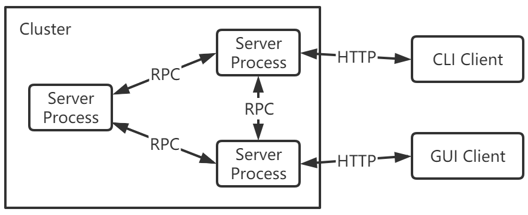

# Final Report

- Group 48

  | Student ID | Name   |
  | ---------- | ------ |
  | 11813121   | 张家澍 |
  | 11811919   | 游正新 |
  | 11811620   | 毛尊尧 |

## 1.Result analysis: 

- Real Time Process Memory Monitor

  Implemented.

- Memory detection for certain C/C++ program

  Implemented.

- Cluster aggregated query support

  Implemented.

## 2.Implementation: Discuss the main technologies used in the project.

### 2.1 Memory usage information extracting 

We use /proc/[pid]/ subdirectory for process monitoring. This directory contains almost all useful information that we want.

#### Memory Parameters:

- **rss**: aka “Resident Set Size”, this is the non-swapped physical memory a process has used. On UNIX it matches “top“‘s RES column). 
- **vms**: aka “Virtual Memory Size”, this is the total amount of virtual memory used by the process. On UNIX it matches “top“‘s VIRT column. On Windows this is an alias for pagefile field and it matches “Mem Usage” “VM Size” column of taskmgr.exe.
- **shared**: memory that could be potentially shared with other processes. This matches “top“‘s SHR column).
- **text**  aka TRS (text resident set) the amount of memory devoted to executable code. This matches “top“‘s CODE column).
- **data**  aka DRS (data resident set) the amount of physical memory devoted to other than executable code. It matches “top“‘s DATA column).
- **lib** the memory used by shared libraries.
- **dirty** the number of dirty pages.

 ### 2.2 hook function and PR_LOAD_LIBRARY

​	LD_PRELOAD is an environment variable of the Linux system. It can affect the runtime linker of the program. It allows you to define the dynamic link library to be loaded first before the program runs. Different dynamically link the same functions in this library. Through environment variables, we can load the dynamic link library between the main program and the dynamic link library, and even cover the normal function library. Our own developer's own method (no need for other people's source code), and in our own direction, we can also use other people's programs to inject the program to achieve our own goals.

### 2.3 Cluster communication

#### What is RPC?

​	RPC (Remote Procedure Call)—Remote Procedure Call, which is a protocol that requests services from remote computer programs over the network without needing to understand the underlying network technology. The RPC protocol assumes the existence of certain transmission protocols, such as TCP or UDP, to carry information and data between communication programs. In the OSI network communication model, RPC spans the transport layer and the application layer. RPC makes it easier to develop applications including network distributed multiple programs.
RPC adopts a client/server model. The requestor is a client, and the service provider is a server. First, the client calling process sends a call message with process parameters to the service process, and then waits for the response message. On the server side, the process stays asleep until the call information arrives. When a call message arrives, the server obtains the process parameters, calculates the result, sends the reply message, and then waits for the next call message. Finally, the client calls the process to receive the reply message, obtain the process result, and then the call execution continues. 

#### Why gRPC?

​	gRPC was originally developed by Google as a language-neutral, platform-neutral, and open source remote procedure call (RPC) system. In gRPC, client applications can directly call methods of server applications on a different machine just like calling local objects, making it easier for you to create distributed applications and services. Similar to many RPC systems, gRPC is also based on the following concept: define a service and specify the methods (including parameters and return types) that can be called remotely. Implement this interface on the server side and run a gRPC server to handle client calls. Having a stub on the client can act like a method on the server.

#### Proto buffer 

​	protobuf is the default message format in gPRC. ProtoBuf is a data serialization protocol (similar to XML, JSON, hessian) developed by Google. ProtoBuf can serialize data and is widely used in data storage and communication protocols. The compression and transmission efficiency is high, the grammar is simple. More significantly, protobuf has muiltiple language support, including(C++, JavaScript, Java etc.), which makes us relaxing to handle communication between C++ Server and SpringBoot client Server.

#### System overview

In proposal, we have 2 plans for system architecture. Our final choice is the design above. Each machine has a `server process` and will detect other members automatically. Users can use CLI or GUI to visit any machine in the cluster to query the full monitoring information about the cluster. HTTP protocol is used in this step so new software is easy to extend based on it.

## 3.Future direction: For this project, discuss the future directions that can be expanded.

### 3.1 Memory Changing Rate Analysis 

Currently, we only extract the information of process memory usage, not the changing rate. For some program with large memory cost, it may lead to misunderstanding of memory leak. Memory changing rate is a more suitable indicator for abnormal memory usage.

### 3.2 Cluster Communication Routing Algorithm

In our present code architecture each server node will connect to all the other server node. If the the number of servers is large, then it will cost large overhead of communication. The more suitable way is to make the connection as a sparse network, and each node only need to receive and push message to a few other nodes. It requires a better routing algorithm. Due to time limit, we leave the work to future work.

## 4.Summary: Summarize the main techniques learned through the project and the experience of teamwork.

### 4.1 Cluster communication framework

The main feature of our project is that we realize the memory usage and leak detection function on cluster of servers, not a single node. This required us to define our own message format, and using inheritance and polymorphism principle to implement it. This is our first experience to make such tool chain.

### 4.2  Realizing memory leak detection by library dynamic loading

The second class we learned is that we can replace native C++ library in runtime. By setting LD_PRELOAD environment variable, we can do much work on the fly, without recompile the source code of process.

### 4.3 File System of Linux

The second class we have learned is that the  using `/proc` directory to realize memory monitor. As the saying goes, "Everything is file". The information of each process is just reside in the `proc` directory, the only thing we need  to do is carefully read the documentation  of linux file System.  

## 5.Division of labor: List the main work for each team member. 

- Jiashu Zhang: 

1.Setting up gRPC framework.

2.Finish writing memory detection part of code.

3.Part of frontend function.

- Zhengxin You:

1.Setting up SpringBoot Server. 

2.FInish writing part of memory monitor function.

3.Setting up frontend with Vue.js.

- Zunyao Mao:

1.Finish writing part of memory monitor part of code

2.Wriring part of gRPC communication function

3.Researching the memory leak detection library
