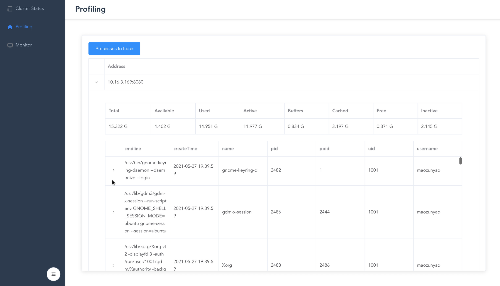
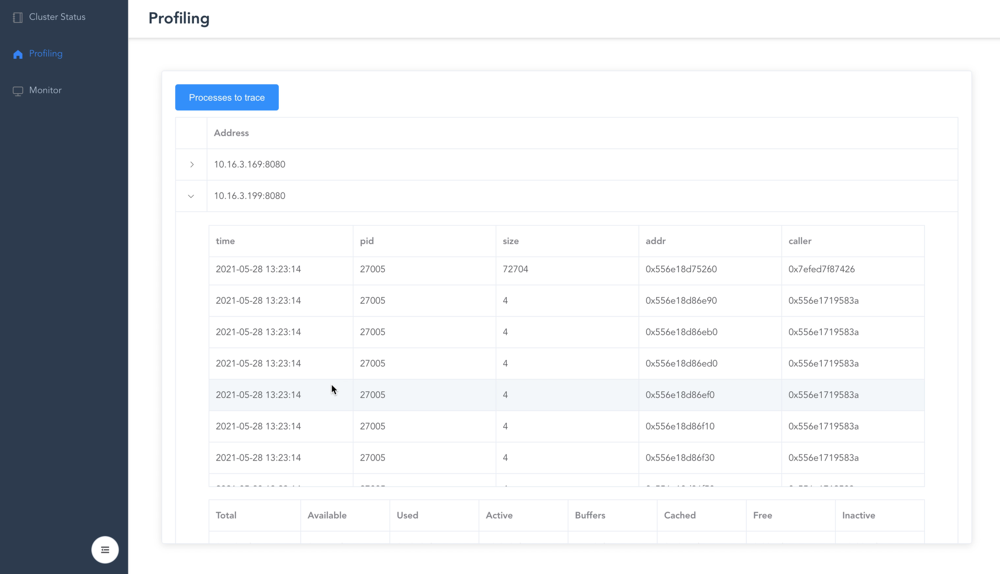
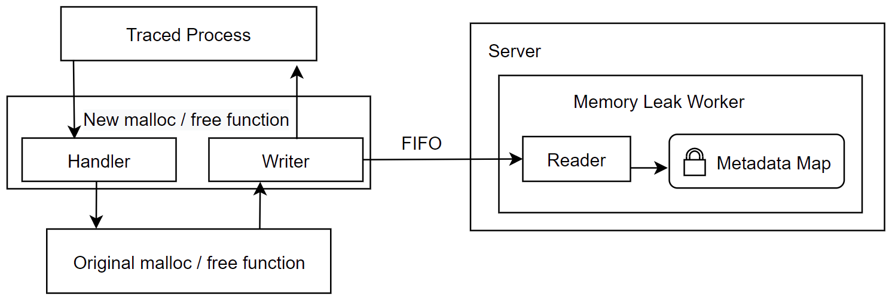
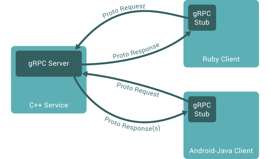

[TOC]

# Final Report

- Group 48

  | Student ID | Name   |
  | ---------- | ------ |
  | 11813121   | 张家澍 |
  | 11811919   | 游正新 |
  | 11811620   | 毛尊尧 |

## 1.Result analysis

- Real Time Process Memory Monitor



  Using web frontend, user can monitor the cluster status and view the detail of server, such as memory usage, and so on.

- Memory leak detection for certain program



  User can set the pid of process to trace on specific server in the cluster. The system will report the infomation of the memory malloc that may have leakage risk, including the time, size, memory address.

- Cluster aggregated query support


  The system also allows user to launch a aggregated query on whole cluster to trace one specific program (chrome here). For now, we provide the total memory usage of target program.

## 2.Implementation: Discuss the main technologies used in the project.

### 2.1 Memory usage information extracting 

​	We use `/proc/[pid]/` subdirectory for process monitoring. This directory contains almost all useful information that we want. Specifically, `/proc/[pid]/statm` contains the process memory parameters as follows: 

#### Process Memory Parameters:

- **RSS**: It is aka name for `Resident Set Size`, this is the non-swapped physical memory a process has used. It including the private memory a process occupy as well as shared library memory.   
- **VMS**: It is aka name for `Virtual Memory Size`, this is the total amount of virtual memory used by the process. Besides RSS, it includes unallocated memory, which can be used later by process.
- **SHARED**: Memory that could be potentially shared with other processes. 
- **TEXT**: The amount of physical memory devoted to executable code.
- **DATA** : The amount of physical memory devoted to other than executable code.
- **LIB** :The memory used by shared libraries.
- **DIRTY**: The number of dirty pages.

The RSS is an effective parameter to tell the memory usage of processes, which is widely used by `psutil` and `top` library. When client sends a request to get memory information, we iterate the file, and get the present information we want.

#### System Memory Parameters:

According to [kernel.org](https://www.kernel.org/doc/html/latest/filesystems/proc.html), the following parameters can indicate the situation of  the whole system memory:

- **total**: The total RAM memory space can be used.
- **available**: The memory that can be given instantly to processes without the system going into swap. This is calculated by summing different memory values depending on the platform and it is supposed to be used to monitor actual memory usage in a cross platform fashion.

- **Used**: Memory used, calculated differently depending on the platform and designed for informational purposes only. **total - free** does not necessarily match **used**.
- **Free**: An estimate of how much memory is available for starting new applications, without swapping. Calculated from MemFree, SReclaimable, the size of the file LRU lists, and the low watermarks in each zone. The estimate takes into account that the system needs some page cache to function well, and that not all reclaimable slab will be reclaimable, due to items being in use. The impact of those factors will vary from system to system.
- **Active** : Memory that has been used more recently and usually not reclaimed unless absolutely necessary.
- **Inactive** : Memory which has been less recently used. It is more eligible to be reclaimed for other purposes.
- **Buffers** : Relatively temporary storage for raw disk blocks shouldn’t get tremendously large.
- **Cached** : In-memory cache for files read from the disk (the pagecache). 
- **Shared** Total memory used by shared memory (shmem) and tmpfs.

 ### 2.2 Hook function and LD_PRELOAD

LD_PRELOAD is an environment variable of the Linux system. It can affect the runtime linker of the program. It allows you to define the dynamic link library to be loaded first before the program runs. Different dynamically link the same functions in this library. Through environment variables, we can load the dynamic link library between the main program and the dynamic link library, and even cover the normal function library. Our own developer's own method (no need for other people's source code), and in our own direction, we can also use other people's programs to inject the program to achieve our own goals.

To implement the memory leak analysis function, we need to record each call of`malloc` and `free`. For each process, we set up a `FIFO` , the FIFO will store a list of information:

```C++
typedef struct malloc_entry_t {
    int64_t time;
    int64_t pid;
    int64_t size;
    int64_t addr;
    int64_t caller;
  } malloc_entry_t;
```

The `molloc` handler will write to the FIFO, and Server will read and update its list periodically and metadata. Because there exist concurrent read-write conflict, STL `mutex` are used to the process memory map. The function call overview can be summarized as the following figure: 




### 2.3 Cluster communication

#### What is RPC?

RPC (Remote Procedure Call)—Remote Procedure Call, which is a protocol that requests services from remote computer programs over the network without needing to understand the underlying network technology. The RPC protocol assumes the existence of certain transmission protocols, such as TCP or UDP, to carry information and data between communication programs. In the OSI network communication model, RPC spans the transport layer and the application layer. RPC makes it easier to develop applications including network distributed multiple programs.
RPC adopts a client/server model. The requestor is a client, and the service provider is a server. First, the client calling process sends a call message with process parameters to the service process, and then waits for the response message. On the server side, the process stays asleep until the call information arrives. When a call message arrives, the server obtains the process parameters, calculates the result, sends the reply message, and then waits for the next call message. Finally, the client calls the process to receive the reply message, obtain the process result, and then the call execution continues. 

#### Why gRPC?

gRPC was originally developed by Google as a language-neutral, platform-neutral, and open source remote procedure call (RPC) system. In gRPC, client applications can directly call methods of server applications on a different machine just like calling local objects, making it easier for you to create distributed applications and services. Similar to many RPC systems, gRPC is also based on the following concept: define a service and specify the methods (including parameters and return types) that can be called remotely. Implement this interface on the server side and run a gRPC server to handle client calls. Having a stub on the client can act like a method on the server.




#### Proto buffer 

Protobuf is the default message format in gPRC. ProtoBuf is a data serialization protocol (similar to XML, JSON, hessian) developed by Google. ProtoBuf can serialize data and is widely used in data storage and communication protocols. The compression and transmission efficiency is high, the grammar is simple. More significantly, protobuf has muiltiple language support, including(C++, JavaScript, Java etc.), which makes us relaxing to handle communication between C++ Server and SpringBoot client Server.

#### System overview


In proposal, we have 2 plans for system architecture. Our final choice is the design above. Each machine has a `server process` and will detect other members automatically. Users can use CLI or GUI to visit any machine in the cluster to query the full monitoring information about the cluster. HTTP protocol is used in this step so new software is easy to extend based on it.

## 3.Future direction: For this project, discuss the future directions that can be expanded.

### 3.1 Memory Changing Rate Analysis 

Currently, we only extract the information of process memory usage, not the changing rate. For some program with large memory cost, it may lead to misunderstanding of memory leak. Memory changing rate is a more suitable indicator for abnormal memory usage.

### 3.2 Cluster Communication Routing Algorithm

In our present code architecture each server node will connect to all the other server node. If the the number of servers is large, then it will cost large overhead of communication. The more suitable way is to make the connection as a sparse network, and each node only need to receive and push message to a few other nodes. It requires a better routing algorithm. Due to time limit, we leave the work to future work.

## 4.Summary: Summarize the main techniques learned through the project and the experience of teamwork.

### 4.1 Cluster communication framework

The main feature of our project is that we realize the memory usage and leak detection function on cluster of servers, not a single node. This required us to define our own message format, and using inheritance and polymorphism principle to implement it. This is our first experience to make such tool chain.

### 4.2  Realizing memory leak detection by library dynamic loading

The second class we learned is that we can replace native C++ library in runtime. By setting LD_PRELOAD environment variable, we can do much work on the fly, without recompile the source code of process.

### 4.3 File System of Linux

The second class we have learned is that the  using `/proc` directory to realize memory monitor. As the saying goes, "Everything is file". The information of each process is just reside in the `proc` directory, the only thing we need  to do is carefully read the documentation  of linux file System.  

## 5.Division of labor: List the main work for each team member. 

- Jiashu Zhang: 

1.Setting up gRPC framework.

2.Finish writing memory detection part of code.

3.Part of frontend function.

- Zhengxin You:

1.Setting up SpringBoot Server. 

2.FInish writing part of memory monitor function.

3.Setting up frontend with Vue.js.

- Zunyao Mao:

1.Finish writing part of memory monitor part of code

2.Wriring part of gRPC communication function

3.Researching the memory leak detection library

## 6. Reference

1.https://github.com/hamon-in/cpslib a set of C library for system memory information profilling.

2.https://psutil.readthedocs.io/en/latest/ psutil A cross-platform library for retrieving information on running  processes and system utilization (CPU, memory, disks, network, sensors) in Python.

3.https://grpc.io/ A modern open source high performance Remote Procedure Call (RPC) framework that can run in any environment.

4.https://www.kernel.org/doc/html/latest/filesystems/proc.html Linux kernel man page.

