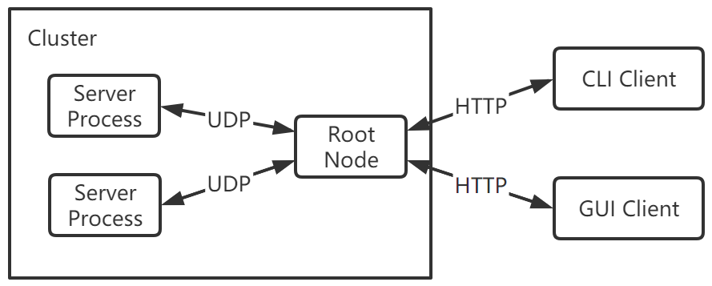

# dtop

This is a course project of CS302 Operating Systems in SUSTech.

Member: Jiashu Zhang, Zhengxin You, Zunyao Mao.

## Project Introduction

Resource monitoring is difficult but important for a cluster. There are serval monitoring framework for distributed system, such as `Zabbix`, `Prometheus`,  and so on. Unfortunately, they have a limited support for memory tracing, and most of them face to only one program.

dtop is a memory monitor and a memory leak detector for Linux clusters. It monitors memory allocation condition of processes and threads, and performs detection of potential memory leak.

## Background
Memory management is a very classic topic for the operating systems. For modern operating systems, hundreds of processes and thousands of threads can be running on a Linux operating system.
Normally, the operating system can manage the memory schedule and distribution smoothly. However, not every program behaves normally.

### Memory Leak

The memory leak is a kind of resource leak when a computer program fails to manage its memory allocation,
, and the memory which is no longer needed can not be used by other programs. The impact of memory leaks varies. If a program just runs for a short time, its leaked memory will be collected by OS when it terminates.
However, if the process runs for a long time or request much memory space,such carelessly written program can cause considerable memory leak, resulting in system slow down, even crush. 
So it is important to monitor the running process for real time, find and solve the problem before too late.

### C/C++ memory leak issue
Unlike most of other languages, C/C++ does not trade performance for safety. Without garbage collection mechanism, C/C++ programmers 
must take more efforts one memory allocation and deallocation. 

As valgrind `memcheck` states, there are several types of memory leak in C/C++ program:

- 1.Leaked temporary workspace

If users allocate memory to a pointer in a function, but neither return the pointer nor free the memory inside the function, it will cause memory leak when calling this function.

- 2.Leaked data member

this mainly happens when user define their own destructor function, but do not free all the data member's memory before deallocate the object.

- 3.leaked static data member

Some data field is shared across all instances of a class, but will be allocate memory for every instance call and do not deallocate previous memory.

- 4.leaked global memory

Similar to the last type of memory leak, some global variables are allocated memory for many times without deallocate previous memory.

- 5.Incorrect array delete

If size of 10 objects' memory are allocated, but you call `delete array`, then maybe only the first object is deleted, and other nine objects are left as memory leak.   

### Related Work

There are mature tools available for resource monitoring and memory leak detection, such as [top](https://www.man7.org/linux/man-pages/man1/top.1.html), [htop](https://linux.die.net/man/1/htop), for memory monitoring;
[Valgrined](https://www.valgrind.org/), [Google Address Sanitizer](https://github.com/google/sanitizers), [BCC](https://github.com/iovisor/bcc) for memory leak detection and analysis. To avoid re-inventing wheels and make our own contributions, we should learn and survey for such tools first before we start our project.       

## Expected Main Functions

- Monitor memory allocation on clusters.

For each single server, we would like to implement something that resembles top. We would like to support memory allocation condition on clusters so that on any single server of a cluster, the user can monitor the memory allocation conditions of all servers. We plan to implement this function through RPC or http.

- Support aggregated query on memory allocation.

We plan to support aggregated query on memory allocation so that the user can monitor the total memory usage of a certain process, like mysqld, on all servers that belong to this cluster.

- Detect potential memory leak.

We expect dtop to be able to detect potential deadlocks and warn users. *Hopefully*, we would be able to support both static analysis based on Valgrind, and runtime detection based on memleak or libleak. Deadlock detection is expected to be able to run both static analysis of a executable, as well as runtime detection of processes. 

## Implementation

### Main functions

- Real Time Process Memory Monitor

In Linux, everything is file, so are process memory information. In Linux, the information of memory allocation is in directory `/proc/[pid]/maps`.
Many memory monitors are based on this directory(top/htop/pmap). For the threads memory information in a process, `/proc/[pid]/task/[tid]/` 
directory stores exact the information we need. We can call proc process, iterate all the processes of users running in operating system
periodically.(e.g. 5 seconds), and set a threshold to find those abnormal frequent or large memory allocation.

- Memory detection for certain C/C++ program

If users find a program  they write have memory leak issues, we can provide a function to further detect it. According to [GOOGLE's Sanitizer Project](https://github.com/google/sanitizers/wiki/AddressSanitizerAlgorithm) and [Valgrind Project](https://valgrind.org/),
The fundamental technology to detect memory leak is replace every memory allocation functions like `malloc` and `free`. When running users program, these tool act as an additional layer between process and OS. For basic implementation, we will based on existing library to realize our user story.
For advanced implementation, we can design our own layer to replace memory allocation function, to collect information more flexibly.

- Cluster aggregated query support

There are two architecture we can use: P2P and tree-like architecture. They will be described following.

### Design 1: P2P Architecture

#### System overview

We plan to use RPC to connect each machine in a cluster. Each machine has a `server process` and will detect other members automatically. Users can use CLI or GUI to visit any machine in the cluster to query the full monitoring information about the cluster. HTTP protocol is used in this step so new software is easy to extend based on it.

#### Query process design

- Each machine has 2 configure files, `static config` and `dynamic config`. User can set the listener port, and one of the IP of the active nodes in static configure file. Then it will ask the active node for the information of other nodes. These information will be saved to the dynamic configure file.
- Client can connect to any machine (target machine) in the cluster. When querying, the target machine will use RPC to fetch the data from all other machines and then return it to client.
- If the RPC method failed for many times, the machine will be marked as inactive node.

### Design 2: Tree Architecture

#### System overview

We plan to use a UDP to send the message between monitored nodes and root node. The root node can provide extra function, such as persistence, and client still use http protocol to fetch the data.

Design 1 is a better choice, but if it has great difficulties in the implementation, this design will be used, which still meets our standard.

### Techniques

- Memory leak detection: [libleak](https://github.com/WuBingzheng/libleak)

This is a lib for memory leak detection. The main idea is to replace the `malloc` function of the system. It will inspire us how to solve this problem.

- RPC framework: [rpclib](https://github.com/rpclib/rpclib)

This lib is used to build the P2P network among the machines in the cluster.

- XML parsing lib: [PugiXML](https://github.com/zeux/pugixml)

We choose to use XML as the format of the settings of our system.

## Milestones

We plan to finish this project by 05.25 or earlier if we are requested by this course.

- [x] 05.03 Investigate /proc. Zhengxin

- [x] 05.05 Build RPC framework of this project. Jiashu

- [ ] 05.05 Investigate memory leak detection. Zunyao

- [ ] 05.08 Implement memory allocation condition request. All

- [ ] 05.12 Implement memory allocation aggregation and display. All

- [ ] 05.14 Implement the memory allocation monitor SDK. All

- [ ] 05.19 Implement memory leak detection. All

- [ ] 05.25 Improve usability and release. All

## Division of Labor

Jiashu Zhang: RPC, usability.

Zhengxin You: Memory allocation condition, usability.

Zunyao Mao: Memory leak detection, usability.
